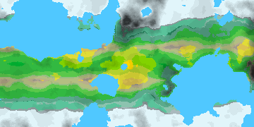

# Atlas Map Generator & History Simulator


A 2D map generator app and history simulator app created as a part of my MSc thesis at Warsaw University of Technology, inspired by games such as Dwarf Fortress, Sid Meier's Civilization and Europa Universalis.

See `atlasgen_manual_en.md` and `atlassim_manual_en.md` for a full configuration and usage documentation.
See `thesis_pl.pdf` for thesis contents (Polish only).

## Building

Debug mode:

```sh
cargo build
```

Release mode:

```sh
cargo build --release
```

## Running

With source code:

```sh
cargo run --bin=atlas_gen
# or
cargo run --bin=atlas_sim
```

With precompiled binary:

```sh
./atlas_gen.exe
# or 
./atlas_sim.exe
```

## Examples

Generated maps




In-app view


