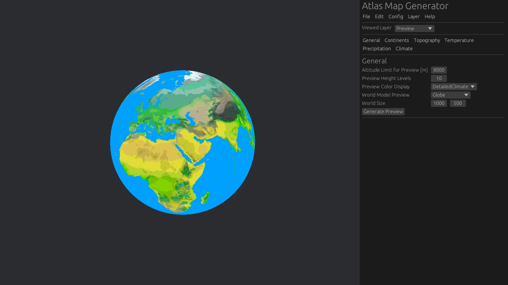

# Atlas Map Generator Manual

## Window Layout

The application layout consists of two parts: map viewport (to the left) and sidebar (to the right).
The sidebar is divided into three parts: title & menu bar, panel tabs and current panel.

## Menu Bar

### File

#### Export World

Displays a folder dialog. When a directory is chosen, the configuration,
some data layers and climate map are saved as files in that directory.

#### Exit

Exits the application.

### Edit

#### Reset Current Panel

Resets all data in the currently viewed sidebar panel to their default values.

### Config

#### Save Configuration

Displays a file dialog. When a file name is entered or an exisiting file is chosen,
the application configuration data is saved to that path in TOML format.

#### Load Configuration

Displays a file dialog. When a file is chosen, the application configuration is read
from that file if it is in TOML format. Default values will be used if not all
configuration data are present in the TOML file.

#### Reset Configuration

Resets the application configuration data to their default values.

### Layer

#### Load Layer Data

Displays a file dialog. When a file is chosen and it is in the correct image format
(PNG 8-bit RGB color sRGB for the map preview, PNG 8-bit greyscale otherwise) and has matching resolution,
data of the currently viewed map layer will be replaced with that in the image.

#### Save Layer Data

Displays a file dialog. When a file name is entered or an exisiting file is chosen,
data of the currently viewed map layer will be saved to that path as a PNG image.
See previous section for image format details.

#### Clear Layer Data

Clears (batch sets to 0) data of the currently viewed map layer.

#### Render Layer Image

Displays a file dialog. When a file name is entered or an exisiting file is chosen,
the preview of the currently viewed map layer will be saved to that path as an image.
The image format will be PNG 8-bit RGB color sRGB.

### Help

#### About

Displays a window with information about the program.

## Generic Generation Settings

### Noise Algorithm

This program uses two dimensional fractal noise as the basis of the generation process, with sample data
scaled to [0.0; 1.0] range.
There are 3 base noise algorithms available:

* Perlin
* OpenSimplex
* SuperSimplex
* FromImage - a special case. No data is generated, useful for when users supply exisitng data and don't want it to be overriden.

The following parameters can be used to customize generation output:

* Seed - the seed of random numbers. Changing the seed gives completely different results,
* Detail (number of octaves) - number of layers of noise overlaid on top of each other. Affects the overall level of detail.
  High level of zoom (low scale) requires higher detail for good results. High detail makes generation slower,
* Scale (frequency) - frequency of sampling. High scale gives more zoomed out results,
* Neatness (lacunarity) - multiplier to frequency for consecutive layers of noise. Small changes give different results,
  large increase will make shapes less defined,
* Roughness (persistance) - power of amplitude for consecutive layers of noise. Low values give blurry shapes, high values give
  rough, high contrast shapes but also increase value,
* Bias - offset to the output *value* in [-1.0; 1.0] range,
* Offset - horizontal and vertical offset of the output. Offset should be scaled when frequency and lacunarity is changed.

### Interpolation

Output (in [0.0; 1.0] range) can be further modifed using three segment (four control point) linear interpolation.
The start and end points have fixed position of 0.1 and 1.0 respectively, while two middle points can be freely moved on the X axis.
Value (Y axis) can be customized for all 4 points. This allows great flexibility in manipulating output ranges and distributions, i.e.:

* Scaling values,
* Reversing values,
* Creating steep slopes,
* Approximating nonlinear transformations.

### Latitudinal Interpolation

Temperature and precipitation use noise algorithms only as supplementary (optional) source of data. The main source of data for these layers
is latitude (map position on Y axis) based linear interpolation, with 9 fixed control points loosely based on circles of lattitude:

* Equator (0 degrees),
* Tropics (23 degrees),
* Temperate zones (46 degrees),
* Arctic/Antarctic (69 degrees),
* Poles (90 degrees),

An additional custom seeting is available, "Non-Linear Tropic Bias". When enabled, the interpolation between equator and tropics
becomes non-linear (in favor of tropics) which may produce better results when creating dry tropical deserts.

### Influence Shape

Each layer can be optionally affected by a special layer called the "influence" map. It is a separate layer
which can scale map data up or down, with intensity controlled by "Influence Strength" setting, depending on chosen mode:

* Scale down - influence values below 1.0 will scale data at that point down.
  This can be used to erase features outside the point of interest, i.e. to remove land at map corners,
* Scale up - influence values above 0.0 will scale data up. This can be used to emphasize features of specific locations,
* Scale down / up - influence values above 0.5 will scale data up, while below 0.5 will scale data down. This is a combination
  of the previous two modes.

Influence map can be generated in many ways:

* None - influence map is not applied,
* Circle - creates a circle defined by position (offset from map center) and radius. Points inside the circle
  have assigned value equal distance from circle center divided by its radius,
* Strip - creates a segment with a circle at each end. The following parameters are available: Segment center (offset from map center),
  segment length, angle between the segment and horizontal axis, segment thickness (also circle radius),
* Fbm - standard noise algorithm with interpolation,
* FromImage - influence map is preserved as is, i.e. when loaded from file.

## Panel Tabs

### General

Configuration for the map in general as well as preview.

The following can be configured:

* Tile resolution - Controls the side length of a map tile, in kilometers. Doesn't affect generation in any way, but is used in the Atlas simulator,
* Altitude limit for preview - Controls the altitude maximum for preview altitude shading. If above 0, tiles will become darker as they come closer to the maximum,
* Preview height levels - Controls how many discrete shading levels should be shown in the preview,
* Preview color display - Controls how the tiles are colored when generating previews:
  * Topography - altitude based color palette (green-yellow-brown-grey),
  * Simplified climate - climate (biome) based color palette, using simplified biome colors,
  * Detailed climate - climate (biome) based color palette.

* World model - Currently only flat (rectangular) world model is available,
  * World size - Horizontal and vertical size (in tiles) of the flat world.

### Continents

Configuration for continents generation. Each map tile can be either a water tile or a land tile.

The following can be configured:

* Sea level - Height of the global sea level as a fraction (0.0-1.0 range).
Layer data (normalised) below this value will be marked as water, otherwise it will be land,
* Standard noise algorithm with quad point interpolation,
* Standard influence shape.

### Topography

Configuration for topography (height map). Each map tile contains altitude data.
Altitude ranges from 0 (sea level) to 255 (10200 meters), with one altitude unit equal to 40 meters.
Topography is affected by continental data - water tiles are forced to sea level altitude.

The following can be configured:

* Coastal erosion range - Controls how far from the coast (in tiles) coastal erosion affects height.
  The closer to coast, the stronger the reduction in height is. Acceptable value range is from 0 (disabled) to 20.
  Note: long range erosion slows down the generation,
* Standard noise algorithm with quad point interpolation,
* Standard influence shape.

### Temperature

Configuration for temperature map. Each map tile contains temperature data (mean annual at surface level).
Temperature ranges from 0 (-50 degrees Celsius) to 255 (+127,5 degrees), with one temperature unit equal
to 0.5 degrees Celsius and value of 100 equal to 0 degrees.

The following can be configured:

* Moist adiabatic lapse rate (MALR) - Controls how much temperature lowers as altitude rises.
  Expressed in Celsius per kilometer,
* Latitudinal settings (values in degrees Celsisus),
* Noise strength - Scales down noise algorithm output,
* Standard noise algorithm with quad point interpolation,
* Standard influence shape.

### Precipitation

Configuration for precipitation (rainfall and snowfall) map. Each map tile contains precipitation data (mean annual).
Precipitation ranges from 0 (0 mm) to 255 (5199 mm), with one precipitation unit equal to 20 milimeters of water.

The following can be configures:

* Altitude of maximum precipitation - Controls the *minimum* altitude at which precipitation begins to lower.
  Expressed in meters,
* Precipitation drop - Controls how much precipitation lowers as altitude rises. Expressed in milimeters per meter,
* Latitudinal settings (values in mm),
* Noise strength - Scales down noise algorithm output,
* Standard noise algorithm with quad point interpolation,
* Standard influence shape.

### Climate

Configuration for climate assigning. Each map tile has assigned an index of a biome from biome list,
based on temperature at precipitation at that location. The exact mapping is controlled by `climatemap.png` file
(PNG 8-bit greyscale, 255x255 pixels), which is essentailly a two dimenstional lookup table:

* Horizontal axis - temperature, from left to right,
* Vertical axis - precipitation, from top to bottom,
* Value at point - index of a biome in the biome list.

Note: the biome list is currently only editable via config file.

Each biome has a name and two color schemes: one for simplified preview (with "similar" biomes sharing colors)
and one for detailed (unique for each biome).

## Tips

* No configuration changes will take effect until you press the "Generate Layer" button for the respective panels.
* Numerical input boxes also act like sliders. Dragging on horizontal axis will decrease or increase value.
* You can drag the edge of the sidebar to adjust its width.
* You can zoom in our out of the map using `+`/`-` keys or mouse wheel.
* If you prefer to work with text files over the GUI, you can save the default configuration and edit its TOML file,
  then load it in Atlas and just generate layers.
