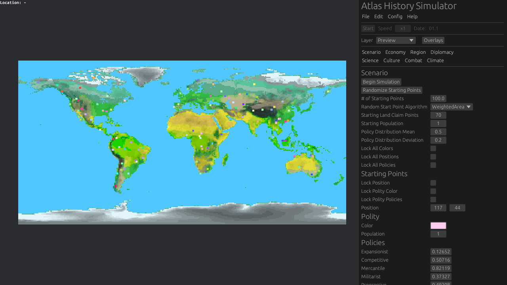

# Atlas History Simulator Manual

## Window Layout

The application layout consists of two parts: map viewport (to the left) and sidebar (to the right).
The sidebar is divided into three parts: title & menu bar, panel tabs and current panel.

## Menu Bar

### File

#### Import Generated World

Displays a folder dialog. When a directory is chosen, the following data
is loaded from that directory from files:

* configuration - `atlassim.toml`,
* preview layer - `preview.png`,
* continental layer - `continents.png`,
* initial topography layer - `topography.png`,
* final topography layer (with sea cutoff and coastal erosion applied) - `realtopography.png`,
* temperature layer - `temperature.png`,
* precipitation layer - `precipitation.png`,
* climate layer - `climate.png`,
* climate map - `climatemap.png`.

#### Exit

Exits the application.

### Edit

#### Reset Current Panel

Resets all data in the currently viewed sidebar panel to their default values.

### Config

#### Save Configuration

Displays a file dialog. When a file name is entered or an exisiting file is chosen,
the application configuration data is saved to that path in TOML format.

#### Load Configuration

Displays a file dialog. When a file is chosen, the application configuration is read
from that file if it is in TOML format. Default values will be used if not all
configuration data are present in the TOML file.

#### Reset Configuration

Resets the application configuration data to their default values.

### Help

#### About

Displays a window with information about the program.

## Panel Tabs

Note: names in parentheses (`example`) are sections or keys in the TOML configuration file that refer to the discussed parameters
accessible via the GUI.

### Scenario (`[scenario]`)

### Economy

### Region

### Diplomacy

### Science

### Culture

### Combat

### Climate (`[climate]`)

Climate settings carried over from Atlas Map Generator. Each map tile has assigned an index of a biome from biome list.

There are two preview modes for this layer:

* Simplified color,
* Detailed color,

Each biome (`biomes`) has a name (`name`) and the following properties:

* Color (`color`) - Color to use for this climate in the detailed climate preview mode. Each biome should have a unique color,
* Color (simplified view) (`simple_color`) - Color to use in the simplified climate preview mode. Similar biomes should share colors,
* Resources (`deposits`) - List of resource deposit IDs that this biome provides with given probability.
  Note: this field can be empty, as all resources have already been assigned in Atlas Map Generator or manually.
* Habitability (`habitability`) - Weight used for assinging starting locations and border expansion costs.

Note: adding or removing biomes from the list is possible only via config file.
